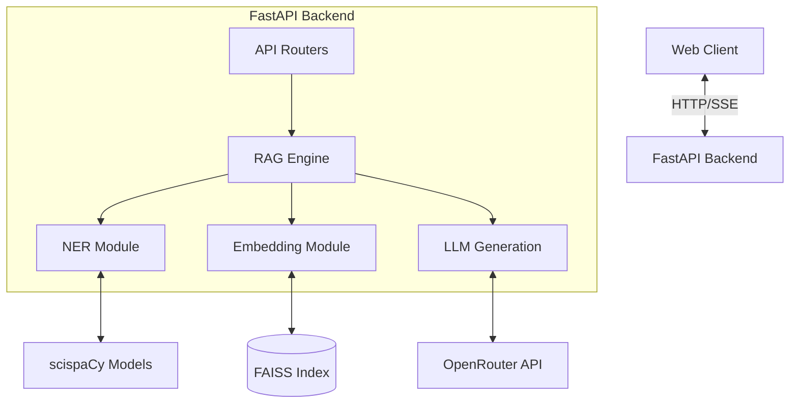
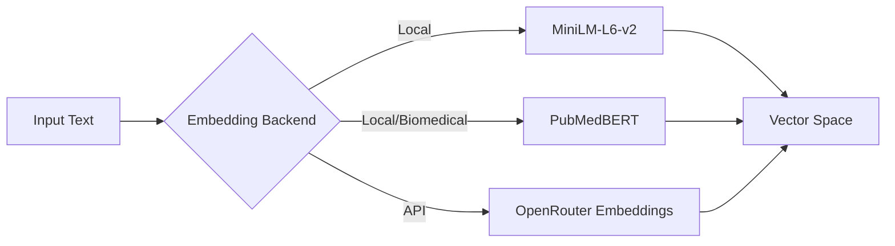
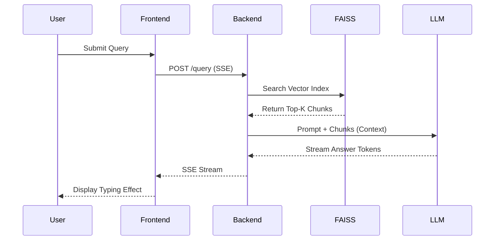

# Architecture

## System Overview
BioGPT Explorer is designed as a modern Retrieval-Augmented Generation (RAG) system specialized for biomedical texts. It employs a decoupled architecture where a React/Vite Single Page Application (SPA) communicates with a FastAPI Python backend. The backend manages the ingestion of biomedical literature, embedding generation, high-speed vector retrieval using FAISS, and context-augmented answer generation via OpenRouter's LLM ecosystem. 

## Component Diagram


## Backend Architecture
### Package Structure
```text
backend/app/
├── main.py           # Application factory, middleware, and route definitions
├── config.py         # Pydantic-based configuration management
├── schemas.py        # Pydantic models for request/response validation
├── llm.py            # Interfaces with OpenRouter, handles fallback logic and streaming
├── embeddings.py     # Wrappers for sentence-transformers, MiniLM, and PubMedBERT
├── ner.py            # Biomedical entity extraction using scispaCy
└── rag/
    ├── engine.py     # Core RAG logic: orchestrates retrieval, re-ranking, and context synthesis
    ├── embedder.py   # Document chunking and embedding generation pipeline
    └── loader.py     # Document ingestion from raw text and external APIs (PubMed)
```

### Request Flow
1. **Request arrives at FastAPI**: The `POST /query` endpoint receives the user's prompt.
2. **Rate limiter checks**: (Optional) In-memory rate limiting prevents API abuse.
3. **Auth check**: Security middleware validates the request (if enabled).
4. **Entity extraction**: If `entity_aware=true`, the `ner.py` module extracts biomedical entities (diseases, drugs, genes) from the prompt.
5. **Vector retrieval from FAISS**: The prompt is embedded and compared against the FAISS index to retrieve the top-K relevant document chunks.
6. **Entity-based re-ranking**: (If entity_aware) Retrieved chunks are re-ranked based on entity overlap with the prompt.
7. **Context assembly**: The top chunks are formatted into a coherent context string.
8. **LLM generation (with fallback)**: The context and prompt are sent to the primary LLM via OpenRouter. If the primary model fails, the fallback chain is triggered.
9. **SSE streaming or JSON response**: The generated answer is streamed back to the frontend using Server-Sent Events (SSE) or returned as a standard JSON payload.

### Embedding Pipeline


### LLM Fallback Chain
```mermaid
flowchart TD
    Start[Generate Answer] --> Primary[Primary Model (e.g. Llama 3 70B)]
    Primary -->|Success| End[Return Response]
    Primary -->|Failure| Secondary[Secondary Model (e.g. Mixtral 8x7B)]
    Secondary -->|Success| End
    Secondary -->|Failure| Tertiary[Fallback Model (e.g. GPT-3.5-turbo via OpenRouter)]
    Tertiary --> End
```

## Frontend Architecture
- **Vite + React SPA**: High-performance frontend tooling with React 18 for component-based UI.
- **SSE handling**: Custom hooks manage Server-Sent Events to provide a typewriter-like streaming experience.
- **Dark theme design**: Modern, sleek aesthetics tailored for long reading sessions and professional use.

## Data Flow


## Infrastructure
### Docker Compose Stack
- **Services description**: A multi-container setup containing the `backend` (FastAPI) and `frontend` (Vite dev server/Nginx).
- **Network topology**: Containers communicate over an isolated bridge network. The backend exposes port 8000; the frontend exposes port 5173.
- **Volume mounts**: The `data/` directory is mounted to persist the FAISS index and scraped documents across container restarts.

### CI/CD
- **GitHub Actions workflow**: Automated testing on pull requests, running the backend `pytest` suite and evaluating code quality with `flake8`/`black`.

## Design Decisions
| Decision | Rationale |
|----------|----------|
| FAISS over pgvector | Simpler setup, no DB dependency for core search. Extremely fast in-memory performance for medium datasets. |
| OpenRouter free tier | Cost constraint, multiple model fallback. Provides access to top-tier open weights (Llama 3, Mixtral) for free. |
| SSE over WebSocket | Simpler implementation, HTTP-native. Perfect for one-way streaming of LLM tokens without connection overhead. |
| scispaCy NER | Domain-specific biomedical entity recognition. Greatly improves recall for specific medical terminology vs general models. |
| In-memory rate limiter | No Redis dependency for basic deployment, keeping the stack lean and portable. |
