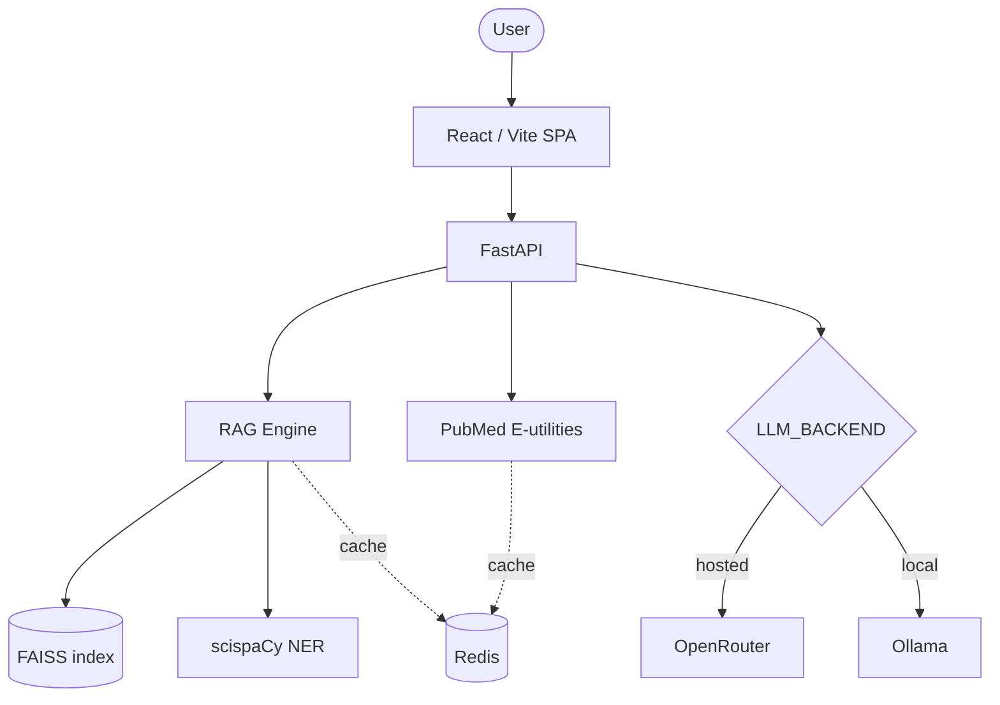

# 🧬 BioGPT Explorer

> A biomedical RAG pipeline with a measured retrieval-strategy comparison


## Overview

BioGPT Explorer answers biomedical questions by retrieving evidence from an
ingested corpus and from **live PubMed**, then generating an answer grounded in
what it retrieved. It ships with an evaluation harness that measures whether its
own retrieval strategies actually work — including a documented negative result.

## Features

- **RAG over FAISS** — PDF and PubMed-abstract ingestion, chunking, vector search.
- **Dual retrieval** — local corpus *plus* live PubMed abstracts, both fed to the
  model as tagged context so citations reflect what it actually read.
- **Entity-aware re-ranking** — biomedical NER (scispaCy) drives IDF-weighted
  score fusion over vector candidates. See [the evaluation](docs/eval_report.md)
  for what this does and does not buy you.
- **SSE token streaming** with per-request model attribution.
- **Pluggable LLM backend** — hosted (OpenRouter) or local (Ollama), behind one
  OpenAI-compatible client. Within a backend, models are tried in order and the
  answer reports which one actually served it.
- **Evaluation harness** — reproducible retrieval metrics (Precision@k, Recall,
  Hit@k, MRR) over corpora built from live PubMed, plus LLM-as-judge generation
  metrics with a judge model distinct from the answering model.
- **Graceful degradation** — when the LLM quota is exhausted, retrieval, NER and
  PubMed search keep working and the API returns an explanatory 503.

## Architecture



## Quick start

**Prerequisites:** Python 3.11+, Node.js 20+, and either a free
[OpenRouter](https://openrouter.ai) API key or a local
[Ollama](https://ollama.com) install (see
[Choosing an LLM backend](#choosing-an-llm-backend)).

```bash
# Backend
cd backend
python -m venv venv
venv\Scripts\activate          # Windows;  source venv/bin/activate elsewhere
pip install -r requirements.txt
python scripts/install_ner_model.py   # biomedical NER (optional but recommended)
cp .env.example .env                  # then set OPENROUTER_API_KEY
make dev                              # http://localhost:8000

# Frontend (separate terminal)
cd frontend
npm install
npm run dev                           # http://localhost:5173
```

> Use `http://localhost:5173`, not `127.0.0.1` — Vite binds the hostname, and
> its dev-server proxy forwards `/query`, `/health` and `/ingest` to port 8000.

### Ingest something

```bash
# A PDF
curl -X POST http://localhost:8000/ingest \
  -H "Content-Type: application/json" \
  -d '{"pdf_path": "data/sample_paper.pdf"}'

# Or straight from PubMed
curl -X POST http://localhost:8000/ingest \
  -H "Content-Type: application/json" \
  -d '{"pubmed_query": "BRCA1 homologous recombination", "max_papers": 10}'
```

### Docker

```bash
cp .env.example .env    # set OPENROUTER_API_KEY
docker compose up --build
```

Two services: the API (with the frontend behind nginx) and Redis. Both are
health-checked, and the backend waits for Redis to pass its check before
starting. The app is served at **http://localhost:3000**.

> **There are two `.env` files and they are not interchangeable.** Compose reads
> the one at the repo root; running the backend directly reads `backend/.env`.
> Hosts differ accordingly — Redis is `redis:6379` inside Compose but
> `localhost:6379` outside, and Ollama is `host.docker.internal` inside but
> `localhost` outside. Copying one over the other silently breaks whichever
> context it wasn't written for. The image installs the biomedical NER model at build time — without
that step `app/ner.py` silently degrades to regex extraction, so the build fails
loudly rather than shipping a quietly weakened container.

## Caching and rate limiting (Redis)

Redis earns its place on three paths, and is **optional on all of them** — if it
is unreachable the app runs uncached rather than failing:

| What | Why it's cached | TTL |
|---|---|---|
| Embedding vectors | Deterministic per (model, text), and on the free tier each one costs API quota. Cached **per text**, so a partly-changed corpus only pays for what changed. | 7 days |
| PubMed abstracts | ~1–2 s per call, and NCBI asks clients not to hammer the endpoint. Cached **per PMID**, since overlapping topic queries return many of the same papers. | 1 day |
| Rate-limit counters | Sliding window in a sorted set. | 60 s |

The rate limiter is the clearest win. The previous implementation kept counters
in a per-process `defaultdict`, which had two defects that only appear in the
configuration this project ships: counters reset on every restart, and
`uvicorn --workers 4` gave each worker its own dict — so the effective limit was
4× the configured value, silently, exactly under the load where a limit matters.

**Postgres was removed rather than wired up.** `docker-compose.yml` previously
declared a `pgvector` service that no code touched. FAISS is this project's
vector store, so a second vector database would have been resume padding with a
maintenance cost attached. Durable query history is the honest reason to add it
back, and there isn't one yet.

## Evaluation

Two retrieval claims are **measured, not asserted**. Both run against corpora
built from live PubMed abstracts and share the same metric code, so their
numbers are directly comparable.

```bash
cd backend
make corpus       # builds both corpora from live PubMed abstracts
make eval         # re-ranking, general suite: 8 unrelated topics
make eval-hard    # re-ranking, hard suite: BRCA1/2, ACE/ACE2, Cas9/Cas12a
make eval-weak    # re-ranking against a deliberately weaker encoder
make compare      # embedding-model comparison, both suites
```

**1. Entity-aware re-ranking gave no meaningful improvement in any of six
configurations** (3 encoders × 2 suites) — a negative result, reported as one.
Hit@3 and MRR are unchanged in every arm, exactly ±0.000, even though the
re-ranker reordered 1–4 of 8 queries each time. Dense retrieval has already
saturated. Rather than assert that explanation, `make eval-weak` tests its
prediction: on the weakest encoder the precision gain quadruples — but the
ranking metrics still do not move, because re-ranking improves good retrievals
and cannot rescue failed ones. The harness also caught three real defects in the
original re-ranker, one of which actively *hurt* precision.
→ **[docs/eval_report.md](docs/eval_report.md)**

**2. A local biomedical encoder matches a hosted general-purpose one 2.7× its
size** — PubMedBERT (768-dim, local) vs `nvidia/nemotron-3-embed-1b` (2048-dim,
API): even on quality, 6–9× faster per query, and free of the API quota.
MiniLM (384-dim, local) is the control and loses decisively, which isolates the
gain to domain pretraining rather than hosting. The two winning encoders agree
on their top-1 chunk for only 1–3 of 8 questions, so equal scores hide
substantially different evidence.
→ **[docs/retrieval_comparison.md](docs/retrieval_comparison.md)**

## Choosing an LLM backend

Both are supported because they are good at different things, and the project
needs both.

| | OpenRouter | Ollama (local) |
|---|---|---|
| Cost | free tier: **50 requests/day** | unmetered |
| Models | up to 550B params | 3B–8B on consumer VRAM |
| Latency | ~2–10 s (network) | ~5 s warm, 30–200 s cold load |
| Offline | no | yes |
| Answer quality | clearly better | adequate, more refusals |

Ollama exposes an OpenAI-compatible API, so both run through the same client
code — only the base URL, credential and model list change.

**The app defaults to OpenRouter** (better answers, and a demo shouldn't require
a 2 GB local model). **The eval harness defaults to Ollama**, because a full
LLM-as-judge pass is ~48 calls and cannot fit inside a 50-request daily
allowance alongside anything else — on the hosted backend that pass could not be
completed at all.

```bash
ollama pull llama3.2 && ollama pull gemma3n:e4b
cd backend && make judge        # generation metrics, no quota consumed
```

To point the app itself at a local model, set `LLM_BACKEND=ollama` in `.env`.
Under Docker use `OLLAMA_BASE_URL=http://host.docker.internal:11434/v1` — inside
a container `localhost` is the container.

## Testing

```bash
cd backend && make test
```

## API

| Endpoint | Description |
|---|---|
| `GET /health` | Service status, active embedding backend, model list, index state |
| `POST /query` | Q&A over the corpus. Supports SSE streaming, entity-aware retrieval, and toggling PubMed context |
| `POST /ingest` | Index a PDF (`pdf_path`) or PubMed abstracts (`pubmed_query`) |

`POST /query` body:

```json
{
  "query": "What are BRCA1 and BRCA2 associated with?",
  "max_results": 5,
  "stream": true,
  "entity_aware": false,
  "use_pubmed_context": true
}
```

## Configuration

| Variable | Description | Default |
|---|---|---|
| `LLM_BACKEND` | `openrouter` (hosted) or `ollama` (local) | `openrouter` |
| `OPENROUTER_API_KEY` | OpenRouter API key (empty = generation disabled) | `""` |
| `OPENROUTER_BASE_URL` | OpenRouter API base URL | `https://openrouter.ai/api/v1` |
| `LLM_MODEL_FALLBACK_LIST` | Models tried in order (JSON array) | 3 free-tier models |
| `OLLAMA_BASE_URL` | Local Ollama OpenAI-compatible endpoint | `http://localhost:11434/v1` |
| `OLLAMA_MODEL_FALLBACK_LIST` | Local models tried in order (JSON array) | `llama3.2`, `gemma3n:e4b` |
| `EMBEDDING_BACKEND` | `openrouter`, `local`, or `biomedical` | `openrouter` |
| `EMBEDDING_MODEL` | Embedding model for the OpenRouter backend | `nvidia/nemotron-3-embed-1b:free` |
| `NER_MODEL` | spaCy model for biomedical NER | `en_core_sci_sm` |
| `FAISS_INDEX_PATH` | Where the FAISS index lives | `data/vector.index` |
| `REDIS_ENABLED` | Use Redis for caching + rate limiting when reachable | `true` |
| `REDIS_URL` | Redis connection URL | `redis://localhost:6379/0` |
| `CACHE_TTL_EMBEDDINGS` | Embedding cache TTL, seconds | `604800` (7 days) |
| `CACHE_TTL_PUBMED` | PubMed cache TTL, seconds | `86400` (1 day) |
| `RATE_LIMIT_REQUESTS_PER_MINUTE` | Per-IP limit (global via Redis, else per-process) | `30` |
| `LOG_LEVEL` | Logging level | `INFO` |

## Project structure

```text
backend/
  app/
    main.py        FastAPI routes, SSE streaming, context assembly
    rag/engine.py  retrieval + entity-aware score fusion
    ner.py         biomedical NER with regex fallback
    pubmed.py      E-utilities client (search / abstracts), cached per PMID
    llm.py         OpenRouter / Ollama client with model fallback
    embeddings.py  OpenRouter / MiniLM / PubMedBERT backends, cached per text
    cache.py       optional Redis layer; degrades to no-op when unreachable
    rate_limiter.py Redis sliding window, in-process fallback
    retry.py       retry policy; daily-quota 429s are not retried
  scripts/
    install_ner_model.py   installs en_core_sci_sm
    build_eval_corpus.py   builds eval corpora from PubMed
    run_eval.py            baseline vs entity-aware comparison
  tests/
frontend/          Vite + React SPA
docs/              evaluation report and retrieval comparison
```

## Known limitations

Stated plainly, because a portfolio project that hides these is worse than one
that names them:

- **Evaluation is 8 questions per suite** — directional, not statistically
  significant. Metrics are lexical-overlap proxies, not human judgments.
- **Redis is optional and best-effort.** If it is unreachable the app runs
  uncached and the rate limiter falls back to per-process counters, which means
  the configured limit is enforced per worker rather than globally.
- **The eval corpora are rebuilt from live PubMed**, so re-running
  `make corpus` may pull different papers than the numbers in the reports were
  measured on. `corpus_manifest.json` records the exact PMIDs used.
- **Free-tier LLM quota is 50 requests/day** (resets 00:00 UTC). When it runs
  out, generation returns 503 while retrieval keeps working. `LLM_BACKEND=ollama`
  removes the limit at the cost of a much smaller model — see below.

## License

MIT
